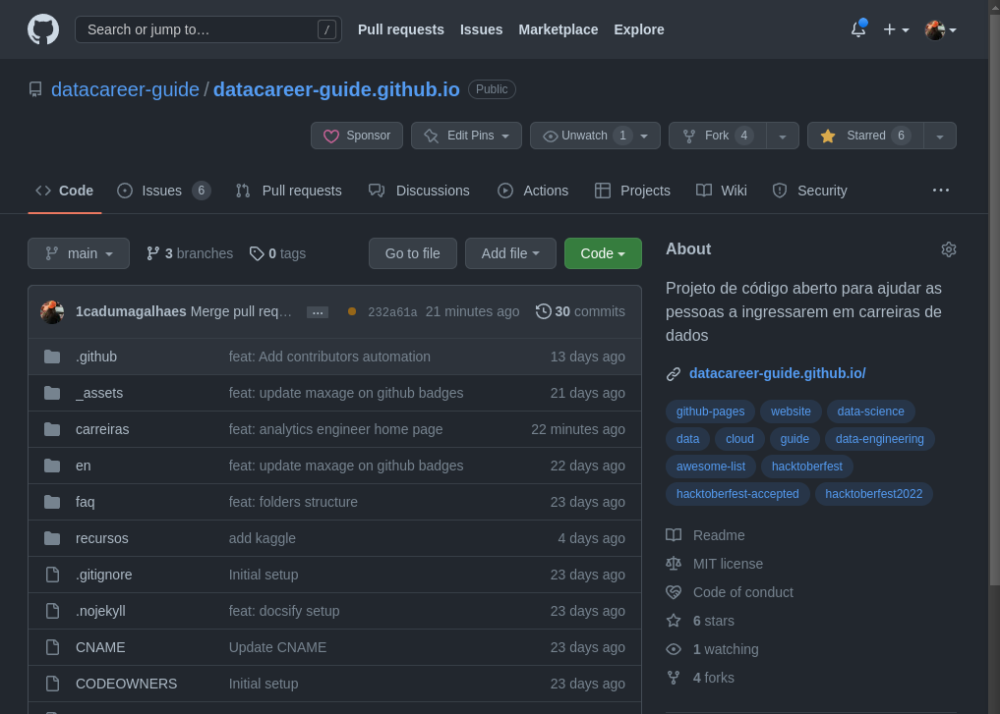
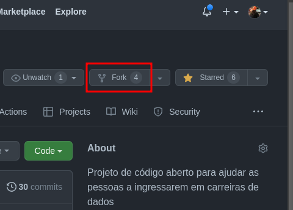
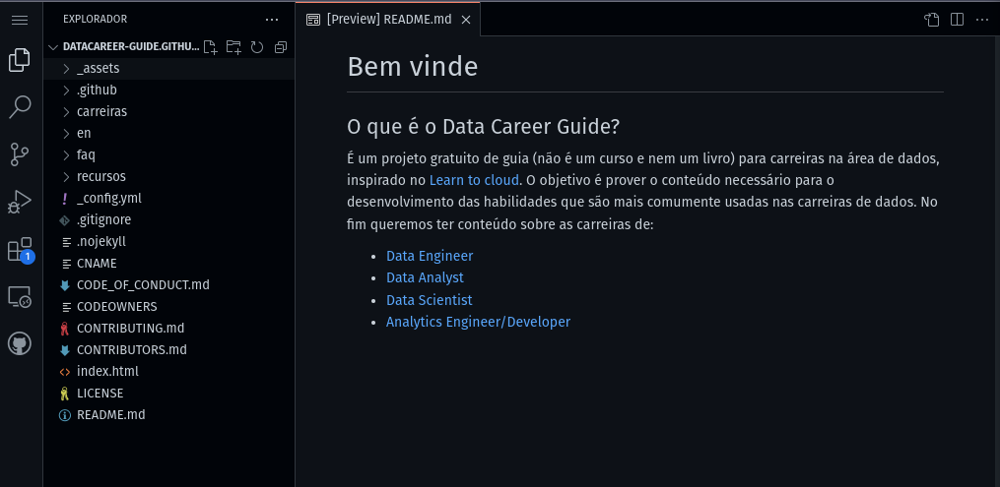
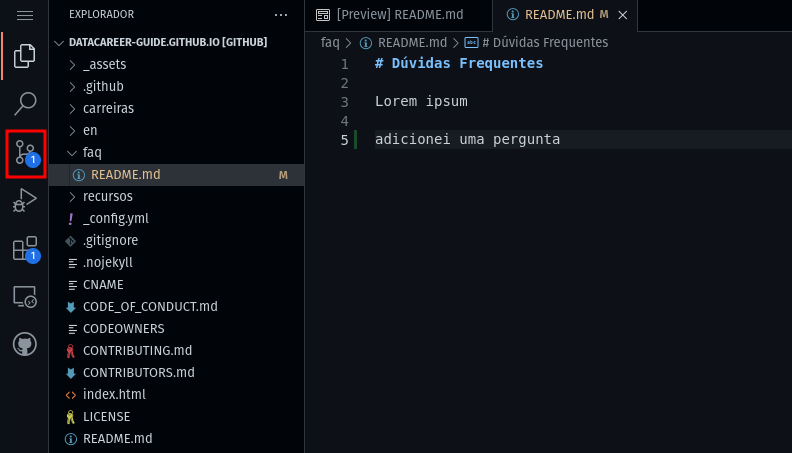
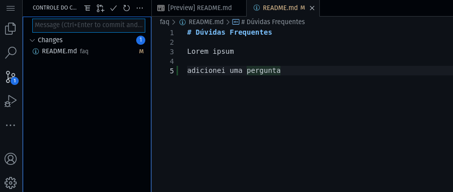
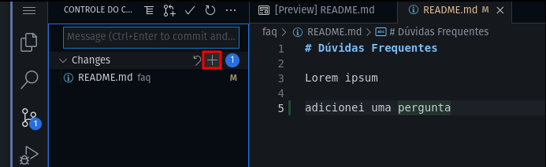
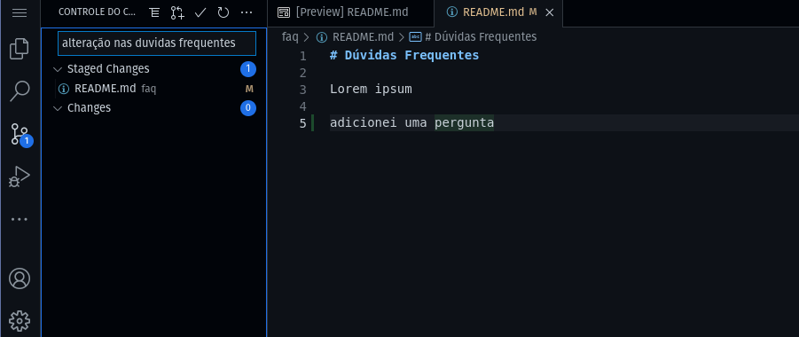
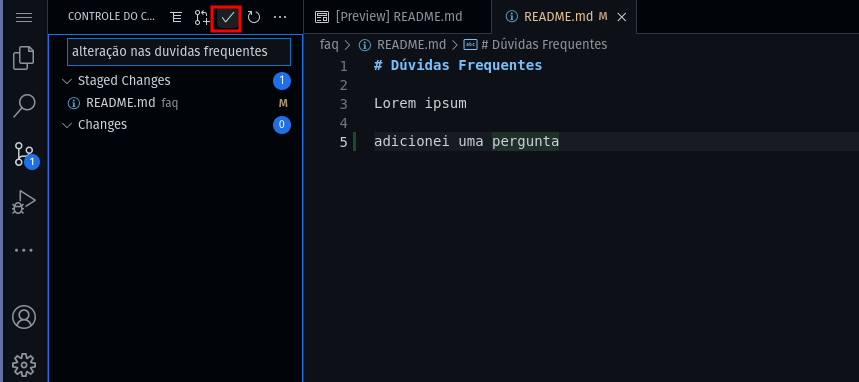
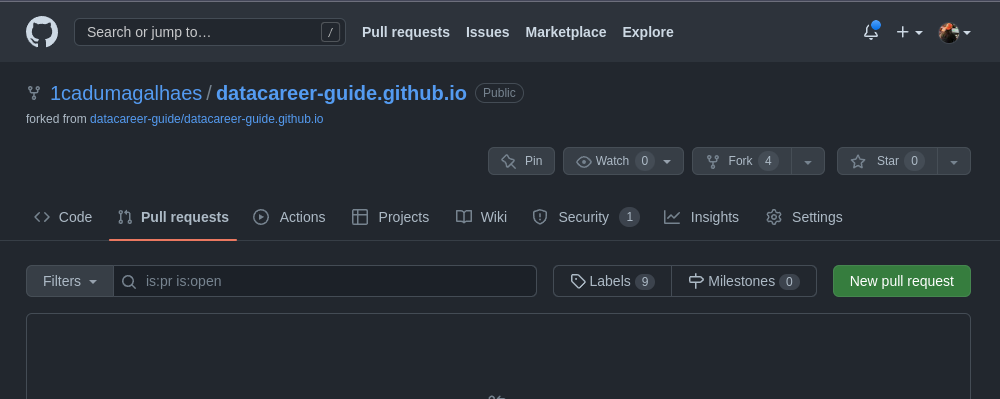
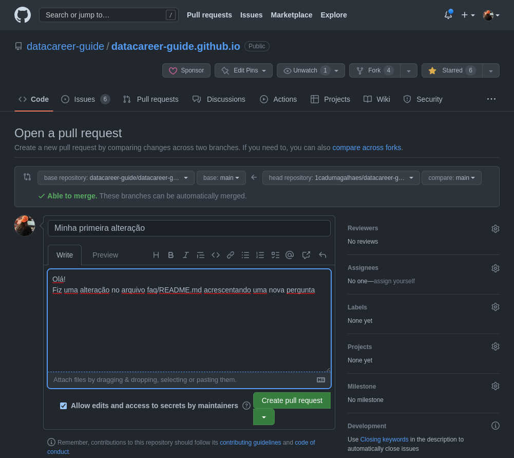

# Como contribuir com o projeto

Estamos procurando pessoas dispostas a:

- Escrever material autoral (desde que com referências)
- Escrever listas de materiais externos (cursos, canais de youtube, blogs, pessoas a seguir, ferramentas)
- Validar tecnicamente os materiais escritos por outros
- Correções ortográficas e adaptação para linguagem neutra
- Traduções para outros idiomas
- Desenvolvimento e evoluções da página

Se você tem interesse em alguma dessas atribuições, bem-vinde!

## O que eu preciso fazer para contribuir

Todo o site é gerado com base em arquivos estáticos escritos em Markdown. Caso não conheça, recomendo [este guia](https://www.markdownguide.org/).

Além disso, é necessário ter uma conta no Github, que é onde todo o material está hospedado. Não é requisito ter conhecimentos de git, já que tudo pode ser feito pela interface, mas certamente será mais fácil se tiver. Porém, não deixe isso te desanimar. Estou a disposição para te ajudar a contribuir.

Se já tiver familiaridade com markdown e uma conta do github, você pode:

1. Usar o botão "Edit on github" nas páginas já existentes. Esse link irá te direcionar para o editor da ferramenta e já na página certa.
2. Acessar o [repositório](https://github.com/datacareer-guide/datacareer-guide.github.io) e editar/criar os arquivos nos quais deseja trabalhar.

Se não souber por onde começar, recomendo:

1. Caso queira escrever sobre algum assunto, olhar as [issues](https://github.com/datacareer-guide/datacareer-guide.github.io/issues) do projeto. Se não existir uma sobre o assunto que quer contribuir, sugiro que inicie uma nova discussão na aba de [discussões](https://github.com/datacareer-guide/datacareer-guide.github.io/discussions) do github. Lá podemos entender em qual parte do projeto sua ideia se aplica além de contribuir com o desenvolvimento e tirar quaisquer dúvidas que tenha.
2. Caso queira validar algum assunto, olhar se existe uma [pull request](https://github.com/datacareer-guide/datacareer-guide.github.io/pulls) aberta.

## Desenvolvendo minha contribuição

Por questões de governança, qualquer material precisa ser aprovado antes de ser incluido no projeto. Por isso, para desenvolver novos materiais é preciso fazer uma **Pull Request** (ou PR).

Para isso, o passo a passo é:

### 1. Acesse o link do repositório

Vá até a página: [Data Career Guide](https://github.com/datacareer-guide/datacareer-guide.github.io/)

### 2. Faça uma cópia (um fork) do repositório na sua conta

Isso irá criar um repositório com o mesmo nome dentro da sua conta.

### 3. Dentro dessa cópia você terá permissão para fazer alterações

Existem múltiplas formas de alterar um repositório do Github. A mais simples é acessá-lo e apertar a tecla `.` (ponto). Isso abrirá o editor web do github, onde você consegue alterar os arquivos.

Depois de fazer suas alterações, acesse o menu de "controle de código-fonte" na esquerda.

Nesse menu você vai encontrar uma lista de todas as alterações feitas.

Em seguida você deve apertar o símbolo de "+" (que é o botão "preparar alterações")

Por último, escreva uma mensagem na caixa de texto e aperta o símbolo de "✓" para enviar suas alterações. É importante usar esse campo para descrever suas alterações de forma resumida. Os detalhes podem ser dados no passo 4.

### 4. Quando tiver finalizado, abra uma Pull Request

Volte para a interface do repositório no seu perfil e vá no menu de "Pull requests".

Lá dentro, pressione o botão de Criar pull request. Isso abrirá mais uma página, e pressione novamente o mesmo botão.

Nessa tela dê um nome para a sua alteração, e descreva de forma detalhada o que foi feito.

Por fim, pressione o botão "Criar pull request". Isso abrirá uma PR no repositório original, e nós seremos notificados. Se for necessária alguma alteração, iremos comentar na mesma PR.

Caso contrário, faremos a aprovação e sua contribuição estará pronta!

## Dúvidas?

Se algo não ficou claro, ou se tem alguma sugestão, fique a vontade para editar! Caso precise de ajuda, crie um tópico na aba de discussões ou crie uma nova issue.
